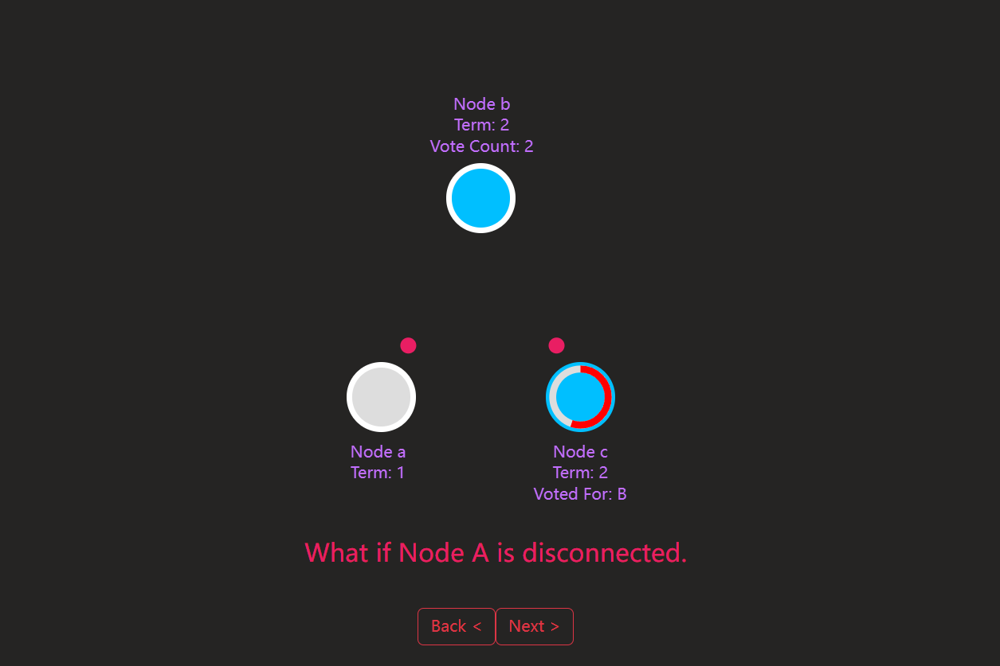
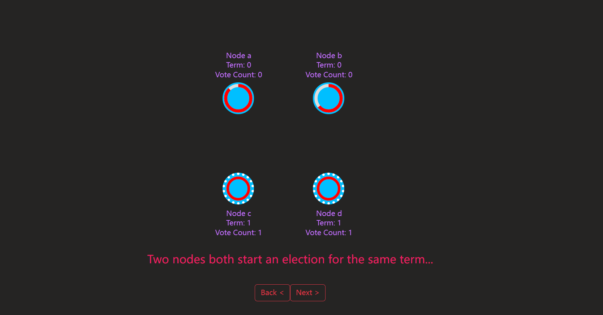
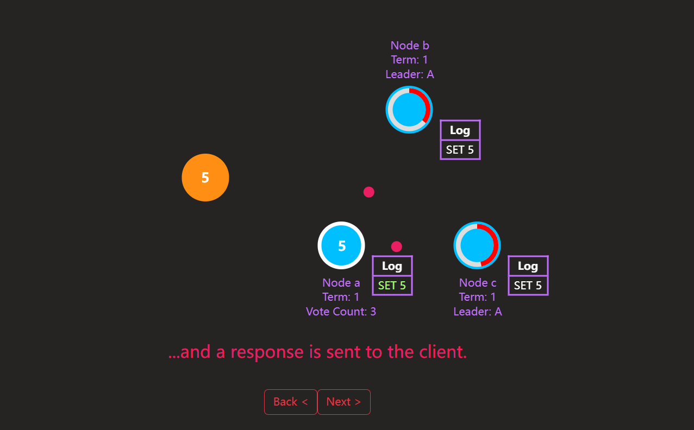

<h1 align="center">
:signal_strength: Raft Animation
</h1>
<p align="center">
React hook + anime.js
</p>

## Authors
[Haoyang Ding](https://github.com/KKDJOSEPH)

## Description
- Temporary Khoury College Special Project
- Project Objective: Revamp the front-end animation of the Raft Consensus Algorithm using simpler techniques and modern technologies.
- Reference Link: https://github.com/benbjohnson/thesecretlivesofdata
- Professor: <a href="https://www.linkedin.com/in/gortonator/"> Ian Gorton </a>

## Clone + Run
```terminal
$ git clone git@github.com:KKDJOSEPH/Game_Review.git
$ npm start
```

## Prerequirements
- [React-hook](https://react.dev/blog/2023/03/16/introducing-react-dev)
- [anime.js](https://github.com/juliangarnier/anime/)

## Notice
- Please note that this document is currently in a working draft phase. :soon:
- Before utilizing it, it is advisable to quickly review each page to ensure that the animations are properly positioned. :book:
- Kindly refrain from rapidly pressing the "next" button multiple times, as it may cause the text to blur together. Please wait until the animations have completed before proceeding. :fast_forward:
- Page 29 contains a significant number of animations, which may result in some issues upon initial arrival. :collision:
- Should you encounter any difficulties, we recommend waiting for the animation to finish, navigating to another page, and then returning. If the issue persists, please restart the project. :wrench:

 ## Screenshots:




### License
[MIT]()
